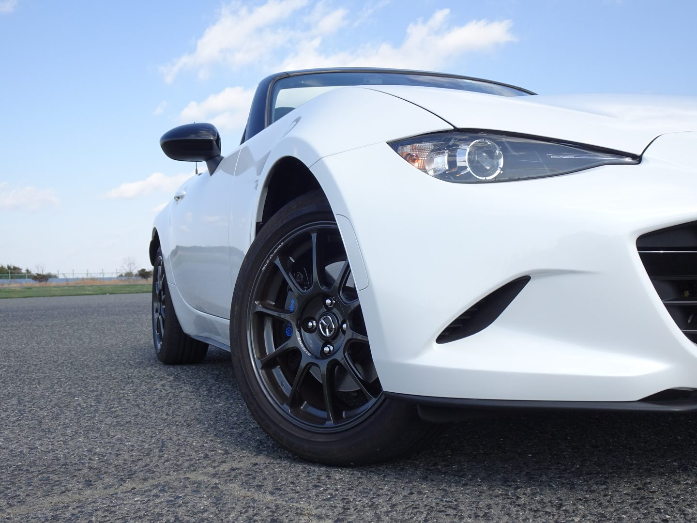
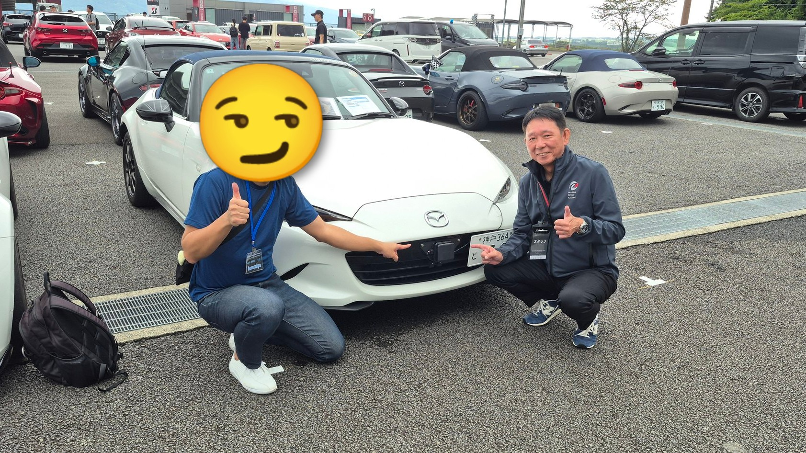

# CAN DBC for MAZDA MX-5 2015-2023 (ND1/ND2)

## About this repository

This repository provides CAN DBC files created through independent reverse engineering and analysis of CAN bus communications for MAZDA MX-5 2015-2023 (ND1/ND2).

The contents are based on personal research, including real vehicle traffic observation, log analysis, and comparison with known behaviors.  
Some signals and definitions are inferred and not officially documented.

## Contents

- CAN DBC files for HS-CAN and MS-CAN  
  - Message and signal definitions (ID, signal name, scale, offset, etc.)  
  - Comments describing signal meaning, behavior, or assumptions  

The contents may be updated as further analysis progresses.

## Target vehicles

This DBC is intended for the following vehicle.

- Manufacturer: MAZDA  
- Model / Platform: MX-5 ND  
- Model year: 2015-2023 (ND1/ND2)  
- Bus type: HS-CAN (500 kbps), MS-CAN (125 kbps)  

Other vehicle models and model years:
- There is a high level of similarity with other Mazda 6th-generation electrical architectures, but some differences may exist.
  - **BCMM** style vehicles show particularly strong similarities and should be mutually useful as references.
    - DEMIO/MAZDA2 (DJ/DL), CX-3 (DK)
  - **FBCM / RBCM** style vehicles have some differences in configuration, but are broadly similar in overall structure.
    - CX-5(KE), CX-5(KF), CX-9(TC), MAZDA3(BM/BN), MAZDA6(GJ/GL)
- **ND3 (2024 and later)** vehicles appear to be significantly different and follow a substantially different architecture.

### Note on Generation Naming Differences

The Mazda MX-5 (ND) uses different generation naming conventions  
in Japan and in overseas markets.

In this repository, each README adopts the naming convention commonly used  
in the language and region it targets.  
The table below summarizes the differences.  
As a result, the Japanese and English README files may use different generation names for the same model years.  
The actual vehicle coverage is consistent between both documents.

| Model years     | Common naming in Japan | Common naming overseas (US/EU) |
|-----------------|------------------------|----------------------------------|
| 2015–2018       | ND1 (early)            | ND1                              |
| 2018–2023       | ND1 (late)             | ND2                              |
| 2024–           | ND2                    | ND3                              |

## What is DBC (CAN DBC)

A CAN DBC (DBC file) is a **database file format** that defines the relationship between raw CAN bus data (binary frames) and human-readable physical values.  
It was developed by Vector and is widely used as the **de facto standard** in the automotive industry.

For a detailed explanation, see CSS Electronics:  
[**A simple intro to DBC**](https://www.csselectronics.com/pages/can-dbc-file-database-intro)

### Tools Supporting DBC

- [**SavvyCAN**](https://www.savvycan.com/)  
  An open-source and free tool. It enables powerful CAN bus analysis using DBC files.

- [**Vector CANdb++ / CANalyzer / CANoe, etc.**](https://www.vector.com/jp/ja/products/products-a-z/software/)  
  These are the original tools from the company that developed the DBC format.  
  They are fully enterprise-oriented tools and not intended for individual purchase,  
  but they are the most widely used tools in development departments of automotive OEMs and Tier-1 suppliers.

## Disclaimer

- The contents of this DBC are not official manufacturer documentation and are based on personal, hobbyist-level analysis.  
  Accuracy and completeness are not guaranteed.  
  The author assumes no responsibility for any damage or loss resulting from the use of this data.
- The analysis is primarily based on a Japanese-market ND2 late-model (990S, MY2022),
  with partial validation on ND1 vehicles.  
  Differences may exist for ND1 vehicles (2015 to early 2018) and for vehicles intended for other markets.

In particular, when connecting to or transmitting messages on a vehicle CAN bus while the vehicle is in motion,  
please do so only with sufficient knowledge and at your own responsibility.

## Contributing
Contributions such as corrections, additional findings, or improvements are welcome.  
Please use Issues or Pull Requests.
By submitting a pull request, you agree that your contribution
is licensed under CC-BY 4.0.

Helpful information includes:

- Target vehicle details  
- Test conditions (driving state, user actions, etc.)  
- Logs or supporting evidence  

## License
This work is licensed under the Creative Commons
Attribution 4.0 International (CC-BY 4.0).

## About the Author
This project was created by **berumiya** from Japan.  
I enjoy customizing the electronics of my Mazda Roadster MY2022 "990S" (MX-5 Miata, ND model).  
You can find more about my work on my SNS profile (all in Japanese): [minkara.carview.co.jp](https://minkara.carview.co.jp/userid/615186/car/3285399/profile.aspx)

